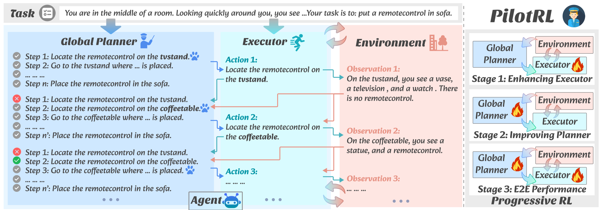

# <div align="center">PilotRL: Training Language Model Agents via Global Planning-Guided Progressive Reinforcement Learning</div>

<div align="center">
<a href="https://arxiv.org/pdf/2508.00344" target="_blank"></a>
<a href="https://github.com/plageon/HierSearch/blob/main/LICENCE"></a>
<a></a>
</div>

Python implementation of ***PilotRL***, a global planning-guided training framework for LLM agents driven by progressive reinforcement learning. We achieve improvements on open-sourced models including LLaMA ([LLaMA3.1-8B-Instruct](https://huggingface.co/meta-llama/Llama-3.1-8B-Instruct)) and Qwen ([Qwen2.5-7B-Instruct](https://huggingface.co/Qwen/Qwen2.5-7B-Instruct), [Qwen3-8B](https://huggingface.co/Qwen/Qwen3-8B)) series. Experiments indicate the superiority of PilotRL, with LLaMA3.1-8B-Instruct + PilotRL surpassing closed-sourced GPT-4o by 3.60%, while showing a more substantial gain of 55.78% comparing to GPT-4o-mini at a comparable parameter scale. 

The graphic below provides an overview of the PilotRL pipeline.



<!-- ## Getting started -->
## 📦 Installation

Our implementation primarily builds upon [`verl`](https://github.com/volcengine/verl). Noted that we utilize `vllm==0.7.3`. 
<!-- To get started, please install the required packages: -->
<!-- ```bash
pip install -r ./myverl/verl/requirements.txt
``` -->

Install verl

`cd ./myverl/verl && pip install -e .`

Install my_reward

`cd ./myverl/my_reward && pip install -e .`

## 🎯 Data Construction
The scripts for data construction are in `./myverl/data_construction/`.
```bash
python ./data_construction/plan_traj_generation_parallel.py
```
The data preprocessing scripts for RL are located in the `./myverl/data_preprocess` directory. These scripts generate the training data in Parquet format within the `./myverl/data` directory.

## ⚡ Verify Model Serving
```bash
export MY_REWARD_USE_TOOL=1
cd ./myverl/my_reward/my_reward && python server.py --port 80 --url "your URL" --model "model_name" --key EMPTY --max_tokens 4096 --temperature 0.6 --top_p 0.9
```

## 🚀 Training
The reinforcement learning (RL) framework is built upon [`verl`](https://github.com/volcengine/verl) with Group Relative Policy Optimization (GRPO) as the learning algorithm, while omitting the KL penalty and applying clip-higher and overlong penalty. 
For training, you can review and modify the relevant parameters in the following scripts.
```bash
cd ./myverl/
bash agent_stage1.sh # Stage 1
bash agent_stage2.sh # Stage 2
bash agent_stage3.sh # Stage 3
```
Before starting the training, you should first deploy the verification model and enter its URL into:
```bash
export DIAGNOSIS_VERIFY_URL="xxx (the verify model's url)"
```

<!-- ## Case Study


 -->

## 🤝 Acknowledge

This implementation is mainly based on [*verl*](https://github.com/volcengine/verl). The model serving is based on [*SGLang*](https://docs.sglang.ai/). We sincerely appreciate their contributions to the open-source community.

## 📜 Citation

```bibtex
@misc{lu2025pilotrltraininglanguagemodel,
      title={PilotRL: Training Language Model Agents via Global Planning-Guided Progressive Reinforcement Learning}, 
      author={Keer Lu and Chong Chen and Bin Cui and Huang Leng and Wentao Zhang},
      year={2025},
      eprint={2508.00344},
      archivePrefix={arXiv},
      primaryClass={cs.CL},
      url={https://arxiv.org/abs/2508.00344}, 
}
```